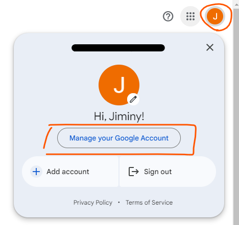
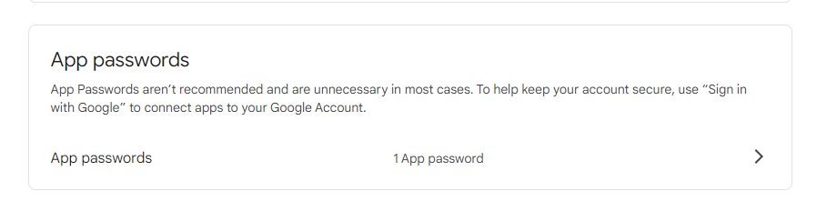

# Birthday Tool with Docker Compose 🎉

Imagine a world where you never miss a friend's birthday again. This project aims to be the ultimate companion, ensuring you remember every special day. One of the greatest challenges of being a good friend is keeping track of birthdays; but let’s face it, life gets busy. That's when this tool comes into play, designed to run on a Raspberry Pi (or any environment, thanks to Docker). It will faithfully remind you of your friends’ birthdays, helping you become the thoughtful friend you’ve always aspired to be! 🎉

To bring this idea to life, we will set up:

- A Docker container hosting a MongoDB database to store all your friends' birthdays.
- Another Docker container with two crucial cron jobs:
    - A daily job at midnight that checks if it's anyone's birthday and sends an email notification with their age.
    - A monthly job on the 1st, summarizing all the upcoming birthdays and sending a comprehensive email with the same details.

Get ready to impress your friends with your impeccable memory and thoughtfulness!

## Index
1. [Introduction](#introduction)
2. [Project Structure](#project-structure)
3. [MongoDB Database Container](#mongodb-database-container)
   - [Docker Build](#docker-build)
   - [Docker Compose Config](#docker-compose-config)
   - [Running the Container](#running-the-container)
   - [Execute Actions Once the Database is Running](#execute-actions-once-the-database-is-running)
   - [How to Backup the Database](#how-to-backup-the-database)
4. [Cronjobs Container](#cronjobs-container)
   - [Send Email](#send-email)
       - [SMTP](#smtp)
       - [Enable Google Apps Authentication](#enable-google-apps-authentication)
   - [Cronjobs Image Build](#cronjobs-image-build)
   - [Docker Compose Config](#docker-compose-config-1)
   - [Secrets](#secrets)
   - [Cronjobs Container Run](#cronjobs-container-run)
   - [Local Tests](#local-tests)
   - [Release new cron-container version on Production](#release-new-cron-container-version-on-production)
5. [Web Server](#web-server)
   - [How to Run It](#how-to-run-it)
6. [Next Steps](#next-steps)

## Project Structure
```bash
mongodb/ #
    ├── __init__.py # File for python to consider this folder as python package
    ├── backup_database.py # Script to extract a dump from a mongodb
    ├── examples.py # Queries examples to execute on the mongodb
    ├── filters.py # Queries to execute from outside the database and request data
    ├── init_mongo.py # Script to define the rules from a new database (if not restored)
    ├── internal_queries.py # Queries for the internal mongodb management (create indexes, configure db, etc.)
    └── restore_database.py # Script to restore a database from a mongodb dump file
static/ # Web server static content
    ├── css/ # Styles
    └── img/ # Pictures 
templates/ # Web server templates to render from controller
    └── base.html # The only template to render
utils/ # Folder containing the shared utilities used in all components
    ├── send_mail.py # Standard method to send an email
    └── utilitites.py # Other methods shared between all components
.dockerignore # File including all the files and folders to no push into docker images
.gitignore # File including all the files and folders to not push into git
check_daily_birthdays.py # File to be executed every day at 00:00 to check if it's the birthday of some friend
                         # and if it is the case, send an email
check_mongo_bakup.py # File to check that the mongodb backup has been done successfully
check_monthly_birthdays.py # File to be executed every month 1st sending via email all the birthdays of the month
crontab # File with the jobs configured
docker-compose.yml # File with the configuration for all docker containers
Dockerfile # Cron image composition file
main_db.py # Python script to execute queries into db
README.md # Repository documentation
requirements.txt # File with python modules to install
webapp.pym # Webapp controller in Flask to server the web
```

## MongoDB Database Container
A mongodb database containing all friends data:
- full name
- alias
- birth
- birth.month
- phone
- sex

### Docker Build
Nothing to build, because I use the default mongodb image. Image can be pulled: 
```bash
docker pull mongo:latest
```

### Docker Compose Config
It can be checked on [docker-compose.yml](docker-compose.yml)

### Running the container
```bash
docker compose up -d mongodb
```

### Execute actions once the database is running
To execute actions on the database, the following python script [main_db.py](main_db.py) should be executed.

> :paperclip: It is recommended to use a python virtual environment
> - Create the virtual environment if it is not created: ```python3 -m venv b-tool-venv```
> - Activate it: ```source b-tool-venv/bin/activate```
> - Install the requirements on it: ```pip install -r requirements.txt```
> - To deactivate it: ```deactivate``` 

Ideas of how to use it checking [mongodb/examples.py](mongodb/examples.py)

#### Make queries on the database
Friends can be inserted by different ways, updated, removed... Check all the methods available in [mongodb/internal_queries.py](mongodb/internal_queries.py)

#### Retrieve data from database
All friends can be retrieved, as well as friends by its name, by its alias, retrieve friends with birthday in specific month, etc. Check all the methods available in [mongodb/filters.py](mongodb/filters.py)

### How to backup the database?
With this process we are going to replicate exactly the mongodb, with all the documents and also the indexes.

In order to backup database we are going to use:
- [mongodb/backup_database.py](mongodb/backup_database.py): which will access the source docker container running the database and dump all data into a local folder `backups/friends_birthdays-%m-%d-%Y`
- By hand, because depending on the database and where the backup of the db is going to be made, it will be a completely different process, I hardly recommend to use `sftp` i both flavours (get/put) to the full path of the backup directory
- [mongodb/restore_database.py](mongodb/restore_database.py): which will copy the backup file into the target docker container running the database and execute a mongorestore.

**The process is:**
:one: Have the repository cloned in the machine running the source mongodb, if not:
```bash
git clone https://github.com/titocampis/b-tool-dcompose.git
```

:two: Access the repository

:three: Ensure that the mongodb container is running
```bash
docker ps
```

:four: Ensure that the `backups/` folder is created, if not:
```bash
mkdir backups
```

:five: Activate the python venv
```bash
source venv-name/bin/activate
```

> :paperclip: **NOTE:** If the python venv is not created:
> ```bash
> python3 -m venv <venv-name>
> ```
> ```bash
> pip3 install -r requirements.txt
> ```

:six: Execute the [mongodb/backup_database.py](mongodb/backup_database.py) script
```bash
python3 mongodb/backup_database.py
```

:seven: The backup file will be created, so it must be send to the target host. It can be done by multiple ways, but i recommend sftp using both flavours (get / put) with the full backup directory path. 

:eight: Access the host where the override is going to be made


:nine: Repeat until step 6 on the target mongodb host

:ten: Execute the [mongodb/restore_database.py](mongodb/restore_database.py) script
```bash
python3 mongodb/restore_database.py
```

Now, check the mongodb has been correctly backed up running:
```bash
python3 check_mongo_bakup.py
```

## Cronjobs Container
Docker container with 2 cronjobs scheduled
- 1 job executed each day at 00:00 to check if it is the birthday of some of my friends, and in case it is, send a mail to my mailbox notifying me about it and with the years he or she is turning
- 1 job executed the 1st day of each month to check and send all the birthdays of the month to my mailbox with the same information

### Send Email
#### SMTP
To send the email we use [smtplib](https://docs.python.org/3/library/smtplib.html) python library which provides a way to send email using the Simple Mail Transfer Protocol (SMTP). It provides methods for logging in to an SMTP server using a username and password which we are going to use and allows sending emails by specifying sender and recipient addresses, subject, and body. It supports plain text and MIME (Multipurpose Internet Mail Extensions) emails.

So we use [smtplib](https://docs.python.org/3/library/smtplib.html) to authenticate in our Google account and send email through this account.

#### Enable Google Apps Authentication
:one: Go into `Google Account Management`:



:two: Go to `Security`

:three: Turn ON `2-Step Verification` (if it is not already enabled)

:four: On the same page as `2-Step Verification`, go to `App passwords`:



:five: Create a new `app password` to authenticate into Google Account using apps.

### Cronjobs Image Build
We can check the configuration of the image in [Dockerfile](Dockerfile)

```bash
docker build -t cron-container .
```

> :paperclip: **NOTE:** [.dockerignore](.dockerignore) file contains the directories / files to not to be included when copy or add in the docker image.

### Docker Compose Config
It can be checked on [docker-compose.yml](docker-compose.yml)


### Secrets

In order to export the `mail_username` and the `mail_password` from the `mail service` we use **docker secrets**. So before running the application, the content of the following files must be fulfilled:

- `secret_mail_username.conf`
- `secret_mail_password.conf`


### Cronjobs Container Run
```bash
docker compose up -d cron
```

### Local Tests
:one: Fulfill the following files with the sensitive data (just if you wanna test send_email):
```bash
vim secret_mail_username.conf
```
```bash
vim secret_mail_password.conf
```

> :warning: **WARNING:** Use `vim` or another text editor to fulfill the content of these files, do not do it through the terminal, because it may be a security weakness to have sensitive raw data in terminal history.

:two: Run the following on terminal
```bash
export SECRET_MAIL_USERNAME_FILE="./secret_mail_username.conf" && \
export SECRET_MAIL_PASSWORD_FILE="./secret_mail_password.conf"
```

:three: Run the application
```bash
python3 check_daily_birthdays.py
```

:four: Remove the sensitive data files:
```bash
rm -rf secret*
```

> :paperclip: It is recommended to use a python virtual environment
> - Create the virtual environment if it is not created: ```python3 -m venv b-tool-venv```
> - Activate it: ```source b-tool-venv/bin/activate```
> - Install the requirements on it: ```pip install -r requirements.txt```
> - To deactivate it: ```deactivate``` 

### Release new `cron-container` version on Production

:one: Access production server

:two: Pull the last version of the `main` branch / clone this repository:
```bash
git pull -v --all
```

:three: Build the new released version of the docker image
```bash
docker build -t cron-container .
```

:four: Fulfill the following files with the sensitive data (just if you wanna test send_email):
```bash
vim secret_mail_username.conf
```
```bash
vim secret_mail_password.conf
```

> :warning: **WARNING:** Use `vim` or another text editor to fulfill the content of these files, do not do it through the terminal, because it may be a security weakness to have sensitive raw data in terminal history.

:five: 
```bash
docker compose up -d
```

:six: Execute the python script you wanna test from the new `cron-container` just created:
- Just db connection:
```bash
docker exec cron-container python3 check_mongo_bakup.py
```

- Db connection + email:
```bash
docker exec cron-container python3 check_monthly_birthdays.py
```

:seven: Remove the sensitive data files:
```bash
rm -rf secret*
```

## Web Server

In this repository, we also have a lite webserver showing the birthdays of my friends.

- [webapp.py](webapp.py): file with the controller of the webapp 
- [static/](static/): static content to show on the web page: images, css (styles)
- [templates/](templates/): templates to render by the controller
- :paperclip: it also uses functions from [utils/](utils/)

### How to run it

As it is a very lite webserver, we do not develop to run it using docker, it will run directly from python:

:one: Activate the python venv
```bash
source venv-name/bin/activate
```

> :paperclip: **NOTE:** If the python venv is not created:
> ```bash
> python3 -m venv <venv-name>
> ```
> ```bash
> pip3 install -r requirements.txt
> ```

:two: Run the [webapp.py](webapp.py) script
```bash
python3 webapp.py
```

:three: Access in your browser: [http://localhost:8080](http://localhost:8080)

> :paperclip: **NOTE:** The webserver is running on debug mode, so you can make hot changes and with Ctrl+s will be applied at the moment.

## Next Steps
| Status | Task |
|----------|----------|
| :white_check_mark: | Change the way you backup the db |
| :white_check_mark: | Think where put webapp but dont remove pupurri (to let horoscope calc) |
